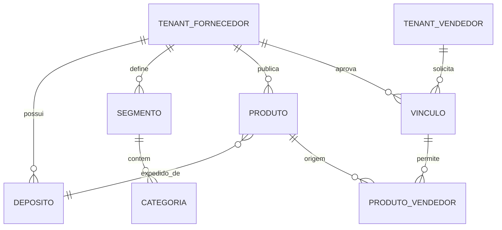
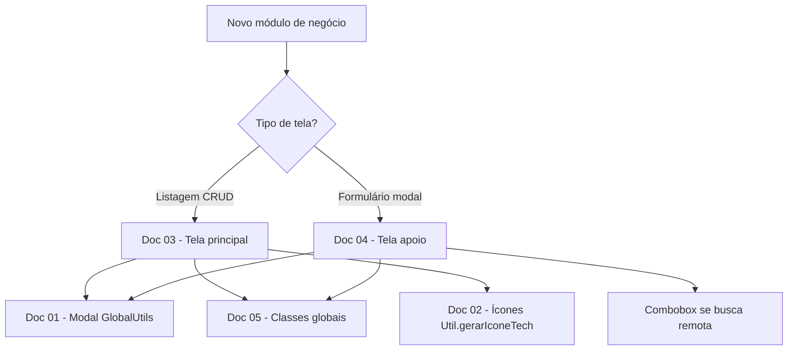

# Plano Mestre de Construção — DropNexo

**Versão:** 2.0 · **Data:** jun/2026  
**Produto:** DropNexo · **Domínio:** dropnexo.com.br  
**Ecossistema:** H74 HUB (Ezra, Cobrax, Premia, Tools, DropNexo)  
**Referência técnica:** `OLD/HUBSUPPORT` + padrões BARACAT em `__doc/01` a `__doc/05`

---

## Sumário

1. [Visão e posicionamento](#1-visão-e-posicionamento)
2. [Crítica estratégica e riscos](#2-crítica-estratégica-e-riscos)
3. [Diferencial: além do catálogo](#3-diferencial-além-do-catálogo)
4. [Arquitetura de módulos V2 — Fornecedor × Vendedor](#4-arquitetura-de-módulos-v2--fornecedor--vendedor)
5. [Roadmap de produto (Fases 1–8)](#5-roadmap-de-produto-fases-18)
6. [Monetização e barreiras competitivas](#6-monetização-e-barreiras-competitivas)
6. [Arquitetura SaaS](#7-arquitetura-saas)
7. [Convenções técnicas obrigatórias](#8-convenções-técnicas-obrigatórias)
8. [Documentação BARACAT](#9-documentação-baracat--como-usar-no-dropnexo)
9. [Fase 0 — Base técnica](#10-fase-0--base-técnica-execução-imediata)
10. [Mapa de módulos (legado)](#11-mapa-de-módulos-e-telas-legado--ver-§4-v2)
11. [Banco de dados](#12-banco-de-dados-visão)
12. [APIs e integrações](#13-apis-e-integrações)
13. [Ecossistema H74 HUB](#14-ecossistema-h74-hub)
14. [IA](#15-ia--oportunidades-reais)
15. [Cronograma](#16-cronograma-sugerido)
16. [Critérios de aceite](#17-critérios-de-aceite-por-entrega)
17. [Checklist antes de codar](#18-checklist-antes-de-codar-cada-tela)

---

## 1. Visão e posicionamento

### 1.1 Conceito

| Elemento | Significado |
|----------|-------------|
| **Drop** | Dropshipping — venda sem estoque próprio |
| **Nexo** | Elo, conexão, rede de distribuição |
| **Missão** | Conectar fornecedores e vendedores em uma única plataforma |

O símbolo da marca comunica: rede, integração, catálogo, escalabilidade.

### 1.2 O que o DropNexo **é**

Marketplace B2B de **distribuição digital** — infraestrutura operacional para:

- Fornecedores, distribuidores, fabricantes, importadores  
- Lojistas, marketplaces, plataformas de e-commerce  
- Operadores logísticos (fases futuras)

### 1.3 O que o DropNexo **não pode ser**

Apenas: **Fornecedor → Catálogo → Vendedor**. Isso é commodity.

O valor está em **operação**: pedidos, estoque sincronizado, margem, SLA, integrações, rede confiável e dados que fazem o vendedor vender mais.

### 1.4 Paleta institucional

| Função | HEX |
|--------|-----|
| Azul escuro (principal) | `#021F81` |
| Azul médio (marca) | `#2C6BF3` |
| Branco | `#FFFFFF` |

Aplicar em `global_utils.py` (`MARCA_COR_*`), variáveis em `app_shell.css` e focos em `global_utils.css`. **Evitar `:root` novo** se as variáveis já existirem no escopo do shell (`body.fg-app { --marca-primary: ... }`).

Assets: `static/imge/icone_dropnexo.png`, `logo_dropnexo_nome.png`.

---

## 2. Crítica estratégica e riscos

### 2.1 Pontos fortes do plano atual

- Visão de **8 fases** coerente com SaaS B2B maduro.  
- MVP enxuto (fornecedor + catálogo + vendedor + importação) validável.  
- Integração com H74 HUB gera **lock-in positivo** e upsell cruzado.  
- Reuso da base HubSupport/BARACAT acelera UI e reduz custo de manutenção.

### 2.2 Lacunas a endereçar cedo

| Lacuna | Por quê importa |
|--------|------------------|
| **Confiança na rede** | Vendedor precisa confiar em estoque, prazo e qualidade do fornecedor |
| **Regras comerciais** | MOQ, prazo de envio, política de troca — antes de “só catálogo” |
| **Split de papéis** | Mesma pessoa pode ser fornecedor e vendedor; permissões devem ser explícitas |
| **Qualidade de dados** | CSV/XML sem validação gera catálogo lixo e churn |
| **Liquidez** | Marketplace morre sem massa crítica de oferta e demanda |
| **Compliance** | NF-e, garantias, produtos regulados — planejar, não ignorar |

### 2.3 O que faria o produto **valer milhões**

1. **Dados proprietários** de performance (margem real, SLA por fornecedor, tendências).  
2. **Integrações profundas** (estoque/pedido bidirecional) — switching cost alto.  
3. **Rede nacional** com logística e pagamento embutidos.  
4. **Receita recorrente** (SaaS + take rate + serviços premium).  
5. **Ecossistema H74** como suite — DropNexo vira “camada de distribuição” dos outros produtos.

### 2.4 O que faria o produto **fracassar**

1. Lançar como catálogo estático sem operação de pedido.  
2. Onboarding difícil para fornecedor (cadastro de 500 SKUs manual).  
3. Estoque desatualizado → cancelamentos → perda de confiança.  
4. Ignorar mobile/performance na busca de produtos.  
5. Monetizar cedo demais sem liquidez.  
6. Código sem padrão (telas fora do BARACAT) → dívida técnica e bugs de UX.

---

## 3. Diferencial: além do catálogo

Funcionalidades que criam **valor operacional** (priorizar no roadmap após MVP):

| Área | Funcionalidade | Valor |
|------|----------------|-------|
| Operação | Pedido com estados, reserva de estoque, SLA | Uso diário na plataforma |
| Dados | Score de fornecedor (entrega, cancelamento, avaliação) | Decisão de compra |
| Financeiro | Simulador de margem (preço venda − custo − frete − taxa) | Vendedor escolhe o que vender |
| Logística | Rastreio unificado, ocorrências | Menos suporte manual |
| Rede | “Fornecedor verificado”, contrato digital de parceria | Confiança B2B |
| Integração | Sync estoque/preço automático | Elimina retrabalho (Fase 3) |
| Inteligência | Ranking e alertas acionáveis (não só gráficos) | Fase 4 |

---

## 4. Arquitetura de módulos V2 — Fornecedor × Vendedor

> **Decisão jun/2026:** separar claramente o **painel do fornecedor**, o **painel do vendedor** e o **back-office do desenvolvedor**. O menu lateral reflete o `tipo_negocio` do tenant (e RBAC). Não misturar “cadastrar empresa na plataforma” com “conhecer fornecedores na rede”.

### 4.1 Princípios

| Princípio | Regra |
|-----------|--------|
| **Dois produtos no mesmo SaaS** | Tenant `fornecedor` vê menu Fornecedor; tenant `vendedor` vê menu Vendedor; `hibrido` vê **ambos** e alterna via `modulo_ativo` na sessão (`POST /api/auth/trocar-modulo`). Ver [§6.3.1](#631-tipo_negocio-do-tenant-ciclo-de-vida). |
| **Catálogo mestre vs cópia do vendedor** | Fornecedor edita **produto origem**. Vendedor edita **só sua vitrine** (nome, descrição, fotos) — **nunca** altera o cadastro do fornecedor. |
| **Parceria com aprovação** | Vendedor **solicita** vínculo → fornecedor **aprova** → só então catálogo e categorias entram no fluxo do vendedor. |
| **Dev fora do menu** | Cadastro inicial do tenant fornecedor (CNPJ, ativação) fica em **Configurações (header)**, visível só para `eh_desenvolvedor`. **Não** aparece na sidebar. |
| **Segmento → Categoria** | Hierarquia de classificação: ver [§4.4](#44-segmento-nicho-e-categoria). |

### 4.2 Back-office — Configurações (header, só desenvolvedor)

**Onde:** link “Configurações” no menu do usuário (header), **não** na sidebar.

**O que faz (escopo restrito):**

- Cadastrar / editar **tenant fornecedor** na plataforma (CNPJ, razão social, ativação, plano).
- **Não** é onde o fornecedor opera dia a dia.
- **Não** substitui Depósitos, Catálogo ou Vendedores do painel fornecedor.

**Remove da UX atual:** botão “Gestão de fornecedores” e fluxo administrativo na rota `/fornecedores` (rede do vendedor).

---

### 4.3 Módulo FORNECEDOR (sidebar do tenant fornecedor)

| Menu | Função |
|------|--------|
| **Depósitos** | Filiais / CDs de expedição (CEP único, endereço remetente, regras de frete por depósito). |
| **Segmentos e categorias** | Árvore **Segmento** (ex.: Roupas, Joias) → **Categorias** (ex.: Camisa feminina, Anéis). |
| **Catálogos** | Produtos mestre: simples/variação, estoque, preço, imagens, **depósito de expedição**, segmento/categoria. |
| **Pedidos** | Pedidos dos vendedores vinculados: aceitar, separar, faturar, despachar, cancelar. |
| **Integrações** | ERP (import catálogo/estoque), futuro: transportadoras. |
| **Vendedores** | Vendedores **ativos**, solicitações **pendentes de aprovação**, recusa, **mala direta** (broadcast). |
| **Usuários** | Equipe com acesso ao painel do fornecedor (RBAC). |

#### Pedidos × Expedição (recomendação de produto)

| Opção | Quando usar |
|-------|-------------|
| **Só Pedidos (recomendado no MVP)** | Uma tela com **estados**: Novo → Aprovado → Em separação → Expedido → Entregue / Cancelado. Filtros por status = “acompanhar expedição” sem menu extra. |
| **Menu Expedição separado** | Quando existir: impressão de etiquetas, API Correios/Jadlog, rastreio em massa, conferência de volumes — volume operacional alto. |

**Decisão sugerida para o plano:** **Pedidos único** na Fase 1–2; extrair **Expedição** na Fase 5 (logística) ou quando integrar transportadora. Configuração de **tabela de frete / etiqueta** pode ficar em **Depósitos** ou **Integrações** antes disso.

---

### 4.4 Segmento (nicho) e categoria

| Termo na UI | Quem cadastra | Exemplo |
|-------------|---------------|---------|
| **Segmento** | **Dev** em Configurações → Segmentos (`tbl_segmento`, `id_tenant` NULL) | Moda, Calçados, Joias |
| **Vínculo** | Fornecedor escolhe (`tbl_fornecedor_segmento`) | Atendo Moda + Calçados |
| **Categoria** | **Fornecedor** (árvore até 3 níveis, por segmento ativo) | Casa e decoração → Cama, mesa e banho → Cama → Lençol de casal |

- Segmentos **não** são criados pelo fornecedor; novos nichos só via plataforma.
- Tela **Segmentos**: pills para ativar nichos + cards (resumo); clique no card abre **Categorias**.
- Menu **Categorias**: lista só segmentos já ativos; árvore editável (níveis 1–3) com `parent_id` e `nivel` em `tbl_categoria`.
- **Categorias permanecem livres** por fornecedor (nomes próprios), sempre ligadas a um segmento oficial que ele atende.
- Combos de produto exibem **caminho** completo (ex.: `Cama › Lençol de casal`).
- Vendedor, ao mapear para marketplace (futuro), usa categorias locais ligadas às do fornecedor (`tbl_mapeamento_categoria`).

---

### 4.5 Módulo VENDEDOR (sidebar do tenant vendedor)

#### 4.5.1 Fornecedores (cards — vitrine de parceiros)

**Layout:** grid de **cards** (não tabela de produtos).

| Elemento do card | Conteúdo |
|------------------|----------|
| Identidade | Nome fantasia, cidade/UF |
| Oferta | Segmentos que atende (chips) |
| Contato | Telefone, e-mail (somente leitura na vitrine) |
| Ações | **Ver catálogo** · **Ativar fornecedor** |

**Fluxo “Ativar fornecedor”:**

1. Vendedor clica → sistema envia solicitação com **dados do vendedor** (tenant, contato, CNPJ/CPF se houver).
2. Card fica **amarelo** + status **“Aguardando aprovação do fornecedor”**.
3. Fornecedor aprova em **Vendedores** → card **verde** / “Conectado”.
4. Se recusar → card cinza / “Não aprovado”.

**“Ver catálogo”:** abre tela (ou modal full) só leitura — produtos em **cards**, sem pedido.

#### 4.5.2 Catálogo (produtos para ativar)

- Lista produtos de **todos os fornecedores aprovados**.
- Filtros: segmento, categoria, fornecedor, em estoque.
- Ação: **Ativar produto** (entra em “Meus produtos” como cópia editável).

#### 4.5.3 Meus produtos

- Produtos **ativados** pelo vendedor.
- Edição de vitrine: título, descrição, fotos, preço de venda — **snapshot** / overlay, sem `UPDATE` em `tbl_produto` do fornecedor.

#### 4.5.3b Precificação (módulo vendedor)

- **Preço do fornecedor nunca é alterado** pelo vendedor (somente leitura na origem).
- Menu **Precificação**: regras **gerais**, por **segmento** ou por **categoria**.
- Campos: % marketplace, % impostos, % taxas, % margem de lucro → ao confirmar, aplica sobre `preco_fornecedor` em `tbl_produto_vendedor` (exceto itens com `preco_manual = TRUE`).
- Fórmula MVP: `preco_venda = preco_fornecedor × (1 + soma_dos_percentuais / 100)`.

#### 4.5.4 Categorias (vendedor)

- Aparecem categorias dos fornecedores **aprovados**.
- Mapeamento para categorias do vendedor (integrações marketplace — Fase 3+).

#### 4.5.5 Kits

- Montagem com itens de **Meus produtos**.
- Se kit mistura **fornecedores/depósitos diferentes** → alerta obrigatório: *“O destinatário pode receber itens em entregas separadas e em dias diferentes.”*

#### 4.5.6 Pedidos

- Pedido ao fornecedor (manual na plataforma; depois também via integração).

#### 4.5.7 Integrações

- ERP do vendedor, marketplaces (futuro).

#### 4.5.8 Expedição (vendedor)

- Como o vendedor entrega **ao cliente final**: etiqueta marketplace, transportadora, Correios, tarifa manual.
- **Diferente** da expedição do fornecedor (origem).

#### 4.5.9 Usuários

- Equipe do vendedor.

---

### 4.6 Modelo de dados (novas entidades principais)



| Tabela / conceito | Descrição |
|-------------------|-----------|
| `tbl_vinculo_vendedor_fornecedor` | `id_vendedor_tenant`, `id_fornecedor_tenant`, `status` (`solicitado`, `aguardando`, `ativo`, `recusado`, `inativo`), dados snapshot do vendedor na solicitação, timestamps |
| `tbl_produto_vendedor` | Cópia comercial do vendedor: FK produto/variante + tenant vendedor + campos editáveis (nome, desc, imagens, preço venda) |
| `tbl_segmento` | Nicho do fornecedor |
| `tbl_categoria` | Filha de segmento (ajustar schema atual) |
| `tbl_pedido` / itens | Fase 2 — pedido vendedor → fornecedor |

---

### 4.7 Observações importantes (lacunas a tratar na implementação)

| # | Tema | Observação |
|---|------|------------|
| 1 | **Notificações** | Aprovação de vínculo, novo pedido, mala direta — e-mail (Brevo) e/ou in-app (novidades). |
| 2 | **Preço e estoque** | Vendedor ativa produto: definir se preço é **fixo do fornecedor**, **margem %** ou **preço livre**; estoque sempre **consulta origem** (não duplicar quantidade na cópia). |
| 3 | **Corte de vínculo** | Pedidos **finalizados** permanecem no histórico; **em aberto** devem ser concluídos. Produtos do vendedor: `ativo=FALSE`, `estoque_vitrine=0` (não altera mestre do fornecedor). |
| 3b | **Tenant híbrido** | Seletor **Módulo** na sidebar (estilo TMS): Fornecedor / Vendedor; menu filtrado por `contexto_modulo`. |
| 4 | **Tenant híbrido** | Empresa que é fornecedor e vendedor: dois menus ou abas “Modo fornecedor / Modo vendedor”. |
| 5 | **LGPD** | Ao solicitar vínculo, vendedor **consente** em compartilhar dados com o fornecedor; fornecedor vê só o necessário. |
| 6 | **Busca e escala** | Cards de fornecedores: paginação + busca por cidade/segmento; catálogo com índice por `id_fornecedor` + full-text futuro. |
| 7 | **Regras comerciais** | MOQ, prazo, devolução — do fornecedor; vendedor vê antes de ativar (no card ou no detalhe). |
| 8 | **Código legado** | Remover/refatorar: `/fornecedores` tabela de produtos, `/fornecedores/gestao`, favoritos diretos sem vínculo — alinhar ao fluxo de aprovação + `tbl_produto_vendedor`. |

---

### 4.8 Ordem de implementação sugerida (pós-decisão V2)

1. **Config (dev):** cadastro tenant fornecedor — header only.  
2. **Fornecedor:** Depósitos + Segmento/Categoria + Catálogo (mestre).  
3. **Vendedor:** Cards fornecedores + vínculo + aprovação (lado fornecedor em Vendedores).  
4. **Vendedor:** Ver catálogo (read-only) → Ativar produto → Meus produtos (cópia).  
5. **Catálogo agregado** (filtros) + Kits com alerta multi-fornecedor.  
6. **Pedidos** (MVP operação) — depois Integrações e Expedição avançada.

---

## 5. Roadmap de produto (Fases 1–8)

### Fase 1 — MVP (validar mercado)

**Objetivo:** Fornecedor publica → vendedor encontra → vendedor vende (fora ou dentro da plataforma).

| Módulo | Entregas |
|--------|----------|
| **Fornecedor** | Cadastro, perfil empresarial, logo, info comercial, políticas |
| **Catálogo** | Produtos, categorias, variantes, imagens, estoque, preço |
| **Vendedor** | Cadastro, busca produtos/fornecedores, favoritos |
| **Importação** | CSV, XLSX, XML (com validação e relatório de erros) |

**Métrica de sucesso:** N fornecedores ativos, M SKUs, X vendedores com favoritos/importação.

---

### Fase 2 — Rede comercial (operação)

Pedidos, aprovação/rejeição, processamento, controle de estoque, dashboard comercial, destaques (produtos/fornecedores).

**Resultado:** Uso diário fornecedor ↔ vendedor **dentro** da plataforma.

---

### Fase 3 — Integrações

| Tipo | Exemplos |
|------|----------|
| Marketplaces | Mercado Livre, Shopee, Amazon |
| E-commerce | Shopify, Nuvemshop, WooCommerce |
| ERPs | Bling, Tiny, Omie |

**Sync:** estoque, preço, pedidos (bidirecional onde possível).

---

### Fase 4 — Inteligência comercial

Ranking produtos/fornecedores, tendências, margem, comparação, oportunidades.

**Regra de ouro:** cada insight deve responder **“o que faço agora?”** — ex.: “Subir preço 8% no SKU X”, “Trocar fornecedor Y por SLA ruim”.

---

### Fase 5 — Operação logística

Logística, rastreamento, SLA, entregas, ocorrências.

**Vantagem competitiva:** painel único pedido + rastreio + SLA + chat Ezra no mesmo tenant.

---

### Fase 6 — Ecossistema H74 HUB

| Sistema | Sinergia com DropNexo |
|---------|----------------------|
| **Ezra** | Chamados pós-venda, suporte fornecedor/vendedor |
| **Cobrax** | Cobrança, inadimplência, crédito entre parceiros |
| **Premia** | Campanhas, metas de vendedor, bonificação por volume |
| **Tools** | Simuladores (margem, frete, imposto) |

**Implementação:** APIs internas + SSO tenant + eventos (webhook interno).

---

### Fase 7 — Marketplace nacional

Rede com transportadoras, gateways, operadores logísticos, curadoria regional, programas de indicação.

**Escala:** multi-região, filas de sync, CDN de imagens, busca (OpenSearch/Elasticsearch).

---

### Fase 8 — IA

Funcionalidades com ROI claro:

- Recomendação de SKU por margem histórica e tendência de busca  
- Alerta de pedido em risco (atraso + fornecedor com SLA baixo)  
- Match vendedor ↔ fornecedor por categoria e região  
- Detecção de catálogo duplicado / preço incoerente  
- Assistente de importação (“corrija 12 linhas do seu CSV”)

---

## 6. Monetização e barreiras competitivas

### 5.1 Modelo de receita sugerido

| Linha | Descrição |
|-------|-----------|
| **Freemium vendedor** | Busca limitada, favoritos, sem sync |
| **Plano fornecedor** | Publicação de catálogo, destaque, analytics |
| **Plano pro vendedor** | Importação ilimitada, integrações, margem |
| **Take rate** | % sobre pedido processado na plataforma (Fase 2+) |
| **Add-ons** | Integração ERP, IA, verificação “selo nexo” |
| **H74 bundle** | Desconto cruzado com Ezra/Cobrax |

### 5.2 Barreiras competitivas

1. Dados de performance de fornecedores (network effect).  
2. Integrações profundas (custo de troca).  
3. Operação de pedido + estoque na mesma base.  
4. Marca H74 + confiança B2B brasileira.  
5. Padrão técnico BARACAT → velocidade de novos módulos.

### 5.3 Escala para milhares de usuários

- PostgreSQL + índices por `id_tenant`  
- Filas (Redis/RQ ou Celery) para importação e sync  
- Object storage para imagens (`upload/`)  
- Cache de busca e CDN  
- Onboarding self-service + templates de importação  
- Programa “fornecedor âncora” por nicho (eletrônicos, moda, etc.)

---

## 7. Arquitetura SaaS

### 6.1 Stack (fase atual)

| Camada | Tecnologia |
|--------|------------|
| Backend | Python 3 + Flask |
| Frontend | Jinja2 + JS vanilla (padrão BARACAT) |
| DB | PostgreSQL |
| Sessão | Flask session + cookie `dropnexo_session` |
| E-mail | Brevo (`api/brevo`) — stub → implementação |
| Pagamentos | Efi (`api/efi`) — stub → planos |
| WhatsApp | `api/whatsapp` — stub |

### 6.2 Multitenancy

Modelo igual HubSupport:

- **Tenant** = conta empresarial (loja do vendedor ou empresa do fornecedor)  
- **Usuário** pode pertencer a vários tenants  
- **Troca de conta** no header (`fg-tenant-switcher`)  
- Toda query de negócio filtra por `id_tenant` da sessão (equivalente BARACAT `id_projeto`)

### 6.3 Papéis (RBAC evolutivo)

| Papel | Escopo inicial |
|-------|----------------|
| `admin_tenant` | Configurações, equipe, plano |
| `fornecedor` | Catálogo, pedidos recebidos |
| `vendedor` | Busca, favoritos, pedidos enviados |
| `h74_admin` | Suporte interno (futuro) |

Um tenant tem `tipo_negocio` persistido em `tbl_tenant`: `fornecedor` | `vendedor` | `hibrido`.  
**Não confundir** com perfil RBAC (`tbl_perfil`: admin, operador, etc.) nem com `modulo_ativo` da sessão (qual painel está aberto na sidebar).

#### 6.3.1 `tipo_negocio` do tenant — ciclo de vida

| Fase | Valor | Regra |
|------|-------|--------|
| **Cadastro público** | `fornecedor` **ou** `vendedor` | O usuário escolhe **um** perfil em `/cadastro?tipo=…`. API `POST /api/cadastro/novo` aceita somente esses dois (`TIPOS_NEGOCIO` em `srotas_cadastro.py`). **Não** existe opção “híbrido” no formulário. |
| **Operação normal** | o escolhido no cadastro | Menu lateral filtrado por `contexto_modulo` (`fornecedor` / `vendedor` / `comum`) conforme `modulo_ativo`. |
| **Evolução futura** | `hibrido` | A conta passa a operar **fornecedor e vendedor** na mesma empresa. Alteração feita pela **plataforma** (ex.: config dev / upgrade de plano) — **não** pelo cadastro público. |
| **Sessão híbrida** | `tipo_negocio = hibrido` | `srotas_plataforma.modulos_disponiveis` retorna `[fornecedor, vendedor]`. Usuário troca contexto via seletor → `POST /api/auth/trocar-modulo`. Rotas usam `@exigir_modulo("fornecedor")` ou `@exigir_modulo("vendedor")` contra `modulo_ativo`, não contra `tipo_negocio` isolado. |

**Rede B2B:** consultas que listam “empresas fornecedoras na plataforma” filtram `tipo_negocio IN ('fornecedor', 'hibrido')` — tenant híbrido aparece como fornecedor na rede.

**Varredura do código (jun/2026):**

| Área | Status | Observação |
|------|--------|------------|
| Cadastro (`srotas_cadastro.py`) | OK | Só `fornecedor` / `vendedor`. |
| Schema (`001_schema_inicial.sql`) | OK | `CHECK` permite os três valores. |
| Navegação (`srotas_plataforma.py`) | OK | Híbrido enxerga os dois módulos; padrão = vendedor. |
| Auth troca módulo (`srotas_auth.py`) | OK | Valida contra `modulos_disponiveis_sessao()`. |
| Guards fornecedor (`fornecedor_painel`, `catalogos`) | OK | `@exigir_modulo("fornecedor")` + helpers `fornecedor \| hibrido`. |
| Guards vendedor (`produtos`, `precificacao`, etc.) | OK | `@exigir_modulo("vendedor")`. |
| Rede / gestão plataforma | OK | SQL usa `fornecedor, hibrido`. |
| Dashboard (`templates/index.html`) | **Pendente** | Trata só `fornecedor` vs “resto”; híbrido deveria exibir atalhos dos **dois** ou respeitar `modulo_ativo`. |
| Tela/API “virar híbrido” | **Pendente** | Não implementado; apenas seed DEV (`bootstrap_db`) usa `hibrido`. |
| Integrações UI | **Pendente** | Duas rotas (`/integracoes` e `/fornecedor/integracoes`) para a **mesma tela** — unificar em `sistema/integracoes` (ver §6.4). |

### 6.4 Estrutura de pastas (oficial — revisão jun/2026)

> **Decisão:** organizar por **papel de negócio** na raiz. Tenant `fornecedor` usa `fornecedor/*`; tenant `vendedor` usa `vendedor/*`; tenant `hibrido` usa **ambos** (troca de módulo). Funcionalidades transversais ficam em `sistema/*`. Integrações de canal (ML, Bling…) são transversais — **não** duplicar em fornecedor e vendedor.

```
dropnexo/                         # raiz (nome da pasta no disco pode ser DROPNEXO)
├── app.py                        # bootstrap Flask
├── global_utils.py               # infra: DB, auth, permissões, marca
├── srotas_acesso.py              # (meta) home pública + login + cadastro
├── srotas_plataforma.py         # navegação + usuários por tenant
├── srotas_negocio.py            # categorias, precificação/vínculos, hub integrações
├── templates/                    # HTML globais: home, login, frm_base, integrações hub…
├── static/                       # CSS/JS/imge globais
├── scripts/                      # bootstrap DB, utilitários
├── upload/                       # arquivos enviados (dados — não é módulo Python)
│
├── fornecedor/                   # tenant tipo fornecedor (e módulo fornecedor do híbrido)
│   ├── depositos/
│   ├── segmentos/
│   ├── categorias/
│   ├── variacoes/
│   ├── catalogo/                 # ex-modulos/catalogos
│   ├── vendedores/               # parceiros vinculados ao fornecedor
│   └── usuarios/                 # equipe do tenant fornecedor
│
├── vendedor/                     # tenant tipo vendedor (e módulo vendedor do híbrido)
│   ├── fornecedores/             # rede B2B (buscar fornecedores)
│   ├── catalogo/                 # ex-catalogo_vendedor
│   ├── meus_produtos/
│   ├── precificacao/
│   ├── pedidos/
│   ├── expedicao/
│   └── usuarios/                 # equipe do tenant vendedor
│
├── sistema/                      # transversal a qualquer tenant logado
│   ├── dashboard/                # /index — home logada
│   ├── perfil/                   # meu perfil, senha, avatar
│   ├── planos/                   # meu plano
│   ├── config/                   # config tenant + rotas admin (dev): segmentos plataforma, fornecedores plataforma
│   └── integracoes/              # hub único ML/Bling/ERP… — rota canônica /integracoes
│
├── api/                          # integrações de infraestrutura (inalterado)
│   ├── brevo/
│   ├── efi/
│   └── whatsapp/
│
├── __doc/
└── OLD/                          # referência somente leitura
```

**Padrão de cada subpasta de feature:**

```
fornecedor/categorias/
├── srotas_categorias.py          # rotas + blueprint (ou register no __init__ do pai)
├── templates/
└── static/
```

**Regras:**

| Regra | Detalhe |
|-------|---------|
| **Raiz `.py`** | `app.py`, `global_utils.py`, `srotas_acesso.py`, `srotas_plataforma.py`, `srotas_negocio.py`. |
| **Sem `modulos/`** | Pasta legada; conteúdo migra para `fornecedor/`, `vendedor/`, `sistema/`. |
| **Integrações UI** | Um módulo em `sistema/integracoes/`; distinto de `api/brevo|efi|whatsapp` (serviços internos). |
| **Templates globais** | `home.html`, `login.html`, `frm_base.html` permanecem em `templates/` na raiz. |
| **CSS/JS** | Por feature em `static/` local da subpasta ou `static/style/C*.css` na raiz — **não** duplicar `global_utils`. |

**Mapeamento legado → novo:**

| Antigo (`modulos/…`) | Novo |
|----------------------|------|
| `fornecedor_painel` (depositos, segmentos, categorias, variacoes, vendedores, usuarios) | `fornecedor/<feature>/` |
| `catalogos` | `fornecedor/catalogo/` |
| `fornecedores`, `catalogo_vendedor`, `produtos`, `precificacao` | `vendedor/…` |
| `vendedor_stub` (pedidos, expedicao, usuarios) | `vendedor/pedidos`, `expedicao`, `usuarios` |
| `dashboard`, `perfil`, `planos`, `config`, `integracoes` | `sistema/…` |

### 6.5 Convenções de código (obrigatório)

| Regra | Detalhe |
|-------|---------|
| **Sem `:root` excessivo** | Cores no `body.fg-app` ou classes `.Cl_*` existentes |
| **Sem helpers em excesso** | Preferir métodos no blueprint; extrair função só se usada em ≥2 rotas |
| **Rotas finas** | Validação + SQL + `jsonify`; lógica repetida vira função no mesmo `srotas_*.py` |
| **Sem modal próprio** | Só `GlobalUtils.abrirJanelaApoioModal` ([doc 01](./01-%20Uso%20do%20Modal(BARACAT).md)) |
| **Telas principais** | [doc 03](./03%20-%20Criando%20tela%20principal-Modelo%20BARACAT.md) |
| **Telas de apoio** | [doc 04](./04%20-%20Criando%20tela%20de%20apoio%20-%20Padrão%20Baracat.md) |
| **Classes** | [doc 05](./05%20-%20Padrão%20Uso%20de%20Class%20Globais%20BARACAT.md) |
| **Ícones** | [doc 02](./02%20-%20Uso%20do%20icone(BARACAT).md) |
| **Combobox** | [Combobox Personalizada](./Combobox%20Personalizada.md) |

**Adaptação BARACAT → DropNexo:** onde o legado diz `id_projeto`, usar **`id_tenant`** da sessão Flask.

---

## 8. Convenções técnicas obrigatórias

### 7.1 Header — menu do usuário (copiar estilo completo)

Replicar de `OLD/HUBSUPPORT/templates/frm_base.html` o bloco **fg-topbar-right**:

1. **Seletor de tenant** (`fg-tenant-switcher`) — troca de conta  
2. **Menu usuário** (avatar + nome + kebab ⋮) com dropdown:
   - **Meu Perfil** → `perfil.meu_perfil` + `frm_meu_perfil.html` + `Smeu_perfil.js`
   - **Meu Plano** → `planos.meu_plano` + `frm_meu_plano.html` (monetização / Efi futuro)
   - **Configurações** → `config.configuracoes` + tela dedicada (**prioridade** — não omitir)
   - **Academia** → substituir por **Central de ajuda** ou `em_breve` (DropNexo não é treinamento HubSupport)
   - **Sair** → `auth.api_logout`

Scripts: `app_shell.js` (dropdown, tenant, logout, foto usuário).

Na Fase 0, **Configurações** e **Meu Plano** podem renderizar `em_breve.html` com layout do menu já funcional; **Meu Perfil** deve vir o mais completo possível do legado.

### 7.2 Sidebar — menu negócio

| Item | Rota | Fase 0 |
|------|------|--------|
| Início | `dashboard.index` | `index.html` funcional (resumo simples) |
| Fornecedores | `fornecedores.*` | em breve |
| Catálogos | `catalogos.*` | em breve |
| Meus produtos | `produtos.*` | em breve |
| Integrações | `integracoes.*` | em breve |

### 7.3 Globais — cópia integral

Copiar **sem cortar** de `OLD/HUBSUPPORT`:

- `global_utils.py`
- `global_utils.css`
- `global_utils.js`

Depois adaptar: marca DropNexo, cores, `application_name=dropnexo`, assets, textos.

### 7.4 Ambiente

Arquivo `.env.example` (nunca commitar `.env` real):

- `MODO_PRODUCAO`, `BASE_HOM`, `BASE_PROD=https://dropnexo.com.br`
- `PORTA` (ex.: 5260)
- `SESSION_COOKIE_NAME=dropnexo_session`
- `DB_*_DEV` / `DB_*_PROD` → `bd_dropnexo`
- `BREVO_*`, `EFI_*`, `WHATSAPP_*` (placeholders)

---

## 9. Documentação BARACAT — como usar no DropNexo

Fluxo ao criar qualquer feature com UI:



| Passo | Documento | Ação |
|-------|-----------|------|
| 1 | 03 | `frm_*.html` extends `frm_base`, filtros `.filter-panel`, Hub JS |
| 2 | 04 | Apoio em iframe, `postMessage` `atualizarTabela`, rotas `/apoio`, `/salvar`, `/deletar` |
| 3 | 01 | Abrir apoio só com `GlobalUtils.abrirJanelaApoioModal` |
| 4 | 05 | Botões `.Cl_botaoprimario`, tabelas `.table-default`, sem CSS duplicado |
| 5 | 02 | Ações da tabela com `Util.gerarIconeTech` |

---

## 10. Fase 0 — Base técnica (execução imediata)

**Objetivo:** Sistema sobe, marca DropNexo, shell completo, rotas placeholder, APIs registradas.

### Etapa 0.1 — Esqueleto

- [ ] `app.py`, `requirements.txt`, `.gitignore`, `.env.example`
- [ ] Registrar blueprints: public, global, auth, dashboard, perfil, config, planos, módulos, api stubs

### Etapa 0.2 — Globais inteiros

- [ ] Copiar `global_utils.py`, `.css`, `.js`
- [ ] Ajustar `MARCA_NOME`, slogan, assets, cores `#021F81` / `#2C6BF3`

### Etapa 0.3 — Base UI centralizada

| Arquivo | Origem |
|---------|--------|
| `templates/frm_base.html` | OLD + menu sidebar DropNexo + **header completo** (perfil, plano, **configurações**, sair) |
| `templates/home.html` + `static/style/home.css` | Adaptar copy DropNexo |
| `templates/index.html` + `static/script/index.js` | Dashboard leve |
| `templates/login.html` | Auth |
| `templates/em_breve.html` | Contatos para melhorias + voltar ao início |
| `static/style/app_shell.css` + `static/script/app_shell.js` | Shell |
| `templates/partials/marca_favicon.html` | Favicon |

### Etapa 0.4 — Conta e header

- [ ] `srotas_auth.py` + login real mínimo
- [ ] `srotas_perfil.py` + `frm_meu_perfil.html` + `Smeu_perfil.js`
- [ ] `modulos/config/srotas_config.py` → configuracoes (em breve → tela real Fase 1)
- [ ] `modulos/planos/srotas_planos.py` → meu plano (em breve)
- [ ] Tenant switcher funcional (copiar APIs `auth.api_listar_tenants`, `api_trocar_tenant`)

### Etapa 0.5 — Módulos placeholder

- [ ] Rotas fornecedores, catálogos, produtos, integrações → `em_breve.html` com `nav_ativo` correto

### Etapa 0.6 — APIs stub

- [ ] `api/brevo/srotas_brevo.py` — `init_app` (implementação depois)
- [ ] `api/whatsapp/srotas_whatsapp.py` — `NotImplementedError`
- [ ] `api/efi/srotas_efi.py` — `init_app` mínimo (sem cobrança legada)

### Etapa 0.7 — Banco mínimo

- [ ] `bd_dropnexo`: `tbl_tenant`, `tbl_usuario`, `tbl_usuario_tenant`, sessão
- [ ] Script SQL em `__doc/sql/` (criar na execução)

### Etapa 0.8 — QA

- [ ] `/` home pública  
- [ ] Login → index com shell  
- [ ] Menu usuário: perfil, plano, **configurações**, sair  
- [ ] Sidebar: 4 itens → em breve  
- [ ] Troca de tenant (se usuário multi-conta)

---

## 11. Mapa de módulos e telas (legado → ver §4 V2)

### Fase 0 (base)

| Módulo | Principal | Apoio | Status |
|--------|-----------|-------|--------|
| dashboard | `index.html` | — | Resumo |
| fornecedores | — | — | em breve |
| catalogos | — | — | em breve |
| produtos | — | — | em breve |
| integracoes | — | — | em breve |
| config | `frm_configuracoes.html` | — | em breve → Fase 1 |
| planos | `frm_meu_plano.html` | — | em breve |
| perfil | `frm_meu_perfil.html` | — | Copiar legado |

### Fase 1 — MVP (detalhe de telas)

| Módulo | Tela principal | Telas de apoio |
|--------|----------------|----------------|
| fornecedores | `frm_fornecedores.html` (busca vendedor) / painel fornecedor | `frm_fornecedor_apoio.html` (perfil) |
| catalogos | `frm_catalogos.html` | `frm_produto_apoio.html`, `frm_categoria_apoio.html` |
| produtos | `frm_meus_produtos.html` (vendedor) | importação wizard |
| importacao | `frm_importacao.html` | preview erros CSV/XLSX/XML |

Rotas REST padrão por entidade (doc 04):

- `GET /<modulo>/apoio?id=`
- `POST /<modulo>/salvar`
- `POST /<modulo>/deletar`
- `GET /<modulo>/listar` (JSON paginado para Hub)

---

## 12. Banco de dados (visão)

### Núcleo (Fase 0)

- `tbl_tenant` (nome, slug, plano, tipo_negocio, ativo)  
- `tbl_usuario` (nome, email, senha_hash, whatsapp, foto)  
- `tbl_usuario_tenant` (papel, ativo)

### Fase 1 — MVP

- `tbl_fornecedor_perfil` (tenant fornecedor, políticas, logo)  
- `tbl_categoria`, `tbl_produto`, `tbl_produto_variante`, `tbl_produto_imagem`  
- `tbl_estoque` (sku, quantidade, reservado)  
- `tbl_favorito` (vendedor × produto)  
- `tbl_importacao_job` (arquivo, status, erros JSON)

### Fase 2+

- `tbl_pedido`, `tbl_pedido_item`, `tbl_pedido_historico`  
- `tbl_integracao`, `tbl_sync_log`

Todas com **`id_tenant`** ou vínculo explícito tenant fornecedor / tenant vendedor.

---

## 13. APIs e integrações

| API | Fase 0 | Fase 1+ |
|-----|--------|---------|
| Brevo | stub | ativação conta, notificações pedido |
| Efi | stub | planos fornecedor/pro |
| WhatsApp | stub | alertas pedido (opcional) |
| Marketplaces/ERP | — | Fase 3 |

Webhook ingress: validar assinatura; fila assíncrona; idempotência.

---

## 14. Ecossistema H74 HUB

| Sistema | Integração sugerida |
|---------|----------------------|
| **Ezra** | Ticket por pedido DropNexo; SSO |
| **Cobrax** | Cobrança entre parceiros B2B; score crédito fornecedor |
| **Premia** | Metas de GMV vendedor; campanhas fornecedor |
| **Tools** | Widget simulador margem embutido na ficha produto |

**Evento interno padrão:** `dropnexo.pedido.criado`, `dropnexo.estoque.baixo` → consumidores H74.

---

## 15. IA — oportunidades reais

Priorizar modelos **explicáveis** e acionáveis:

1. **Score de confiança do fornecedor** (regras + ML leve)  
2. **Recomendação de catálogo** (“vendedores como você importaram X”)  
3. **Alerta de margem negativa** após sync de preço  
4. **Classificação automática** de categoria na importação  
5. **Resumo de ocorrências** de entrega (NLP em texto livre — Fase 5)

Evitar “chat genérico” sem dado — fracassa em confiança B2B.

---

## 16. Cronograma sugerido

| Período | Entrega |
|---------|---------|
| Semana 1–2 | **Fase 0** completa (base + auth + shell + em breve) |
| Semana 3–6 | **Fase 1** fornecedor + catálogo CRUD + busca vendedor |
| Semana 7–8 | Importação CSV/XLSX + validação |
| Mês 3–4 | **Fase 2** pedidos + dashboard comercial |
| Mês 5+ | **Fase 3** primeira integração (ex.: Bling ou ML) |
| Contínuo | Fases 4–8 conforme tração e receita |

---

## 17. Critérios de aceite por entrega

### Fase 0 — Base

- [ ] Marca DropNexo e cores aplicadas  
- [ ] Globais carregam em todas as páginas autenticadas  
- [ ] Header: tenant + menu com **Configurações** visível e clicável  
- [ ] Padrão BARACAT documentado no README `__doc`  
- [ ] Nenhum secret no git  

### Fase 1 — MVP

- [ ] Fornecedor publica produto com imagem e estoque  
- [ ] Vendedor busca e favorita  
- [ ] Importação com relatório de erro  
- [ ] Telas seguem docs 01–05  

### Fase 2 — Operação

- [ ] Pedido ponta a ponta com reserva de estoque  
- [ ] Dashboard com KPIs acionáveis  

---

## 18. Checklist antes de codar cada tela

- [ ] Estende `frm_base.html`?  
- [ ] CSS só em `static/style/C<nome>.css` (exceções mínimas)?  
- [ ] JS Hub único `window.Hub` (telas principais)?  
- [ ] Apoio usa GlobalUtils modal (doc 01)?  
- [ ] Backend filtra `id_tenant`?  
- [ ] Ícones via `Util.gerarIconeTech` (doc 02)?  
- [ ] Não criou variável `:root` nova sem necessidade?  
- [ ] Rota não tem helpers demais — lógica clara no blueprint?  

---

## Apêndice A — Funcionalidades extras recomendadas

- **Convite de parceiro** (fornecedor convida vendedor e vice-versa)  
- **Catálogo privado** (só vendedores aprovados)  
- **Tabela de frete** por região (fornecedor)  
- **API pública** para integradores (Fase 3)  
- **Selo DropNexo Verificado** (auditoria manual + SLA)  
- **Programa de onboarding** com import template por nicho  

## Apêndice B — Referência rápida de arquivos legado

| Necessidade | Caminho OLD |
|-------------|-------------|
| Shell completo | `templates/frm_base.html` |
| Home | `templates/home.html` |
| Index | `system/dashboard/templates/index.html` |
| Perfil | `templates/frm_meu_perfil.html`, `srotas_perfil.py` |
| Config | `system/config/srotas_config.py` |
| Planos | `system/planos/` |
| Auth | `srotas_auth.py`, `templates/login.html` |
| Em breve | `templates/em_breve.html` |

---

**Próximo passo após validação deste documento:** executar [Fase 0 — Etapas 0.1 a 0.8](#9-fase-0--base-técnica-execução-imediata) no código da raiz do projeto.

*Documento vivo — atualizar versão ao concluir cada fase.*
